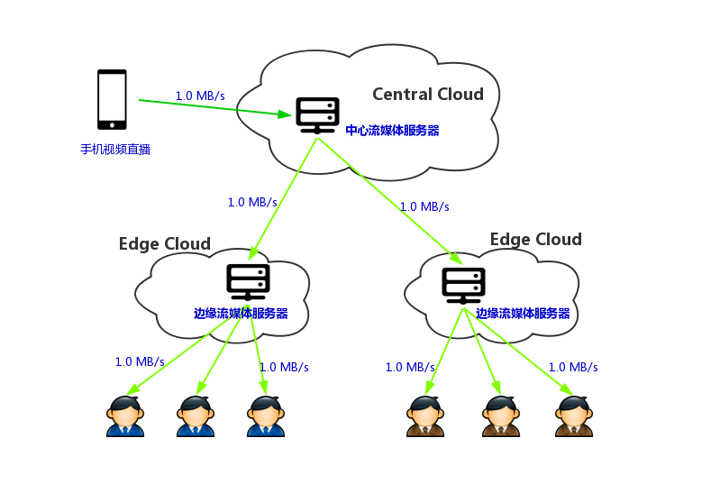

# live-stream
基于分布式云的网络直播应用

### 应用介绍
在中心云上创建个虚拟机跑一个流媒体服务器，边缘云上也创建虚拟机跑流媒体服务器，然后用手机推送视频流到中心云，通过浏览器访问边缘云虚拟机可以看到手机视频直播，而且**不管有多少用户访问边缘云的流媒体服务器，中心到边缘的视频流占用的带宽基本不变**

### 准备环境
- 中心云和边缘云上各上创建一台centos实例，两台虚拟机通过业务网络连通
- 配置本机免密登录, ssh-copy-id -i {id_rsa.pub} username@XXX

### 部署直播应用
- 修改ansible/hosts文件中的主机地址
- 切换到ansible/目录下
- 执行命令 ansible-playbook all.yml